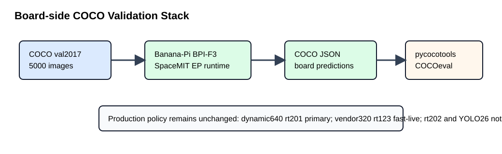
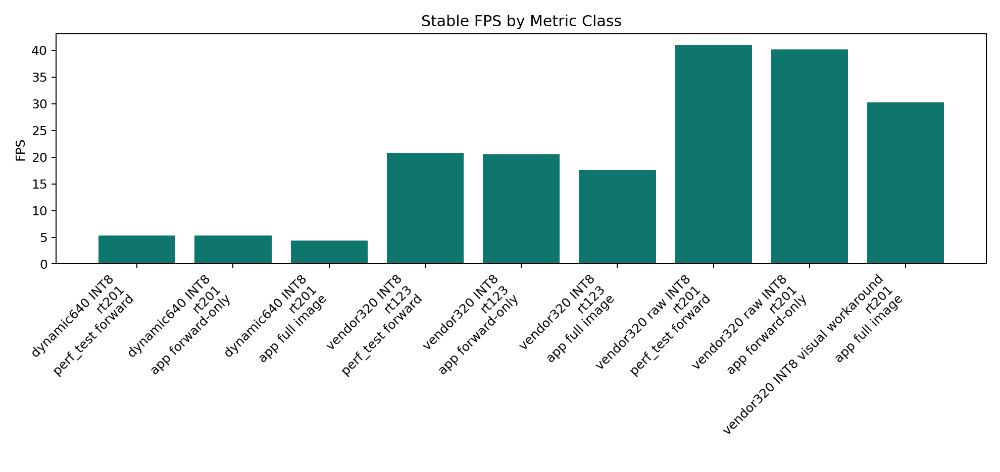
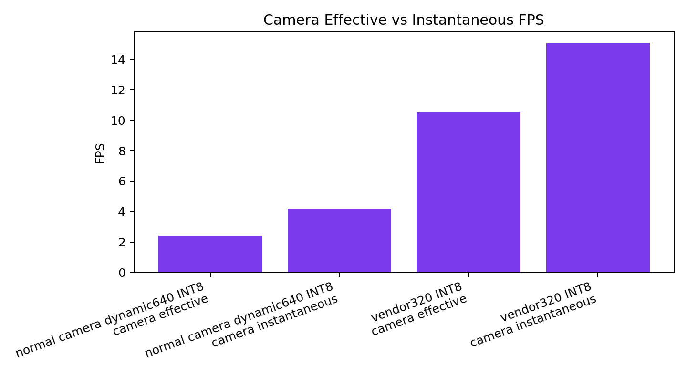
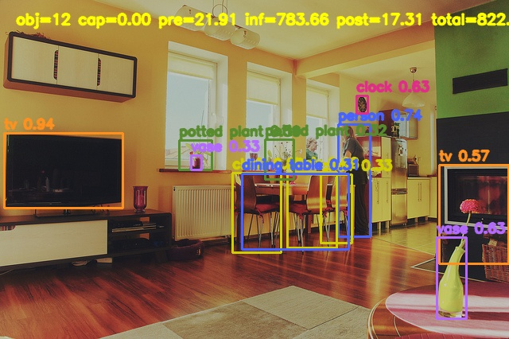
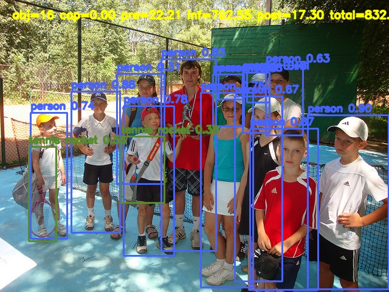

# Slide 1 — Title

Banana YOLO11 SpacemiT Demo — финальные COCO mAP и FPS evidence
Production tag: `production-2026-07-02` -> `9c0933be58ee122389d1a43f45f81e80655d6904`

# Slide 2 — Executive Result

- Primary dynamic640 INT8 on `rt201`: COCO AP@[.50:.95] **0.384**.
- Trusted vendor320 INT8 on `rt123`: COCO AP@[.50:.95] **0.211**.
- Runtime/model policy не изменена; tag не перемещался.

# Slide 3 — Hardware / Software Stack

# Slide 4 — Runtime / Model Policy

- Primary image и normal camera: dynamic640 INT8 on `rt201`.
- Fast-live и trusted vendor320 visual: vendor320 INT8 on `rt123`.
- Vendor320 raw `rt201`: perf-only.
- FP16: experimental. `rt202` и YOLO26: not production.

# Slide 5 — Demo Modes

- Image demo: `./scripts/run_image_demo.sh`.
- Normal camera: `./scripts/run_camera_demo.sh`.
- Fast-live camera: `./scripts/run_camera_demo_fast.sh`.

# Slide 6 — COCO mAP

|Candidate|Runtime|Status|Images|Detections|AP@[.50:.95]|AP50|AP75|AP_small|AP_medium|AP_large|AR1|AR10|AR100|
|---|---|---|---:|---:|---:|---:|---:|---:|---:|---:|---:|---:|---:|
|Primary dynamic640 INT8|rt201|production primary|5000|691410|0.384006|0.539212|0.419599|0.191668|0.420989|0.556876|0.307861|0.505896|0.556047|
|Vendor320 trusted visual|rt123|fast-live / trusted visual|5000|330235|0.211281|0.333139|0.225284|0.037406|0.204024|0.413734|0.209826|0.340494|0.369700|
|Vendor320 rt201 visual workaround|rt201|non-default workaround|5000|514015|0.216324|0.337841|0.234206|0.042726|0.218581|0.400563|0.212091|0.336105|0.364450|

# Slide 7 — FPS by Metric Class

# Slide 8 — Camera FPS

# Slide 9 — Visual Evidence

# Slide 10 — Reproducibility

- Board-side prediction generation with `banana_yolo11_coco_eval_<runtime>`.
- Official pycocotools COCOeval on host.
- Raw logs: `/data/ncnn-logs/ort-logs/2026-07-01_10-44-19`.

# Slide 11 — Limitations

- mAP измерен только для production visual candidates.
- Metric classes — разные workloads.
- Camera FPS зависит от live camera conditions.

# Slide 12 — Final Status

Production validation/report package ready. Runtime/model policy unchanged. Production tag unchanged.
