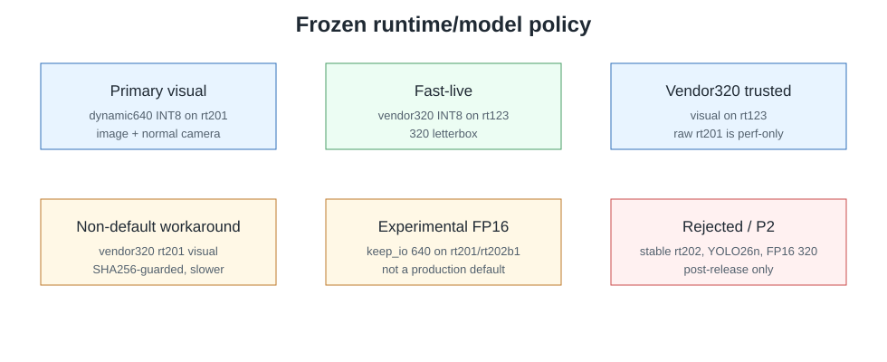

# Banana YOLO11 SpacemiT Demo
Финальный production handoff package

- Production tag: `production-2026-07-02`
- Tag target: `9c0933be58ee122389d1a43f45f81e80655d6904`
- Board: Banana-Pi BPI-F3 / SpacemiT K1X

---

# Executive Message

- Production handoff завершён: open P0/P1 отсутствуют.
- Primary visual path: dynamic640 INT8 on `rt201`.
- Fast-live path: vendor320 INT8 on `rt123`.
- Метрики разделены по class; это не единый FPS leaderboard.

---

# Hardware / Software Stack


- Host/container workspace: `/data`
- Board target: `svt@banana`
- Toolchain: SpacemiT v1.1.2, RV64GCV + zfh/zvfh baseline
- Runtime: SpacemiT ONNX Runtime with SpaceMIT EP

---

# Runtime / Model Policy



---

# Demo Modes

| Mode | Command | Runtime/model | Status |
| --- | --- | --- | --- |
| Image | `./scripts/run_image_demo.sh` | dynamic640 INT8 on `rt201` | default visual |
| Normal camera | `./scripts/run_camera_demo.sh` | dynamic640 INT8 on `rt201` | default camera |
| Fast-live | `./scripts/run_camera_demo_fast.sh` | vendor320 INT8 on `rt123` | responsive branch |
| Headless | `HEADLESS_FLAG=1 ./scripts/run_camera_demo.sh` | dynamic640 INT8 on `rt201` | supported |

---

# Performance Headline Table

| Metric class | Production path | Runtime/model | Mean latency ms | FPS | Interpretation | Source artifact |
| --- | --- | --- | ---: | ---: | --- | --- |
| `perf_test forward` | Primary dynamic640 | `rt201`, generated dynamic640 INT8 | 190.024 | 5.2623 | ORT inference ceiling only. | `docs/FPS_SUMMARY.md`, Day 2 `performance_regression_matrix.md` |
| `app forward-only` | Primary dynamic640 | `rt201`, generated dynamic640 INT8 | 190.567794 | 5.247476 | App session path without full image/camera overhead. | `docs/FPS_SUMMARY.md`, Day 2 `performance_regression_matrix.md` |
| `app full image` | Primary dynamic640 | `rt201`, generated dynamic640 INT8 | 233.480423 | 4.283014 | Still-image production visual path. | `docs/FPS_SUMMARY.md`, Day 2 `performance_regression_matrix.md` |
| `camera effective` | Normal camera | `rt201`, generated dynamic640 INT8 | N/A | 2.069 | Wall-clock live loop over Day 4 bounded smoke. | `docs/FPS_SUMMARY.md`, Day 4 final acceptance |
| `camera instantaneous` | Normal camera | `rt201`, generated dynamic640 INT8 | 238.716 | 4.189 | Per-frame timing, not loop FPS. | `docs/FPS_SUMMARY.md`, Day 4 `final_smoke_matrix.md` |
| `camera effective` | Fast-live camera | `rt123`, vendor320 INT8 | N/A | 9.382 | Responsive live branch over Day 4 bounded smoke. | `docs/FPS_SUMMARY.md`, Day 4 final acceptance |
| `camera instantaneous` | Fast-live camera | `rt123`, vendor320 INT8 | 67.121 | 14.898 | Per-frame timing for fast-live frame 20. | `docs/FPS_SUMMARY.md`, Day 4 `final_smoke_matrix.md` |
| `app full image` | Vendor320 trusted visual | `rt123`, vendor320 INT8 | 57.540777 | 17.378980 | Trusted 320 still-image visual branch. | `docs/FPS_SUMMARY.md`, Day 2 `performance_regression_matrix.md` |
| `app forward-only` | Vendor320 perf-only | raw `rt201`, vendor320 INT8 | 24.210065 | 41.305136 | Low-latency benchmark branch, not visual default. | `docs/FPS_SUMMARY.md`, Day 2 `performance_regression_matrix.md` |
| `app forward-only` | FP16 keep_io 640 experimental | `rt201`, FP16 keep_io 640 | 273.265611 | 3.659443 | Experimental only, not default. | `docs/FPS_SUMMARY.md`, Day 2 `performance_regression_matrix.md` |


---

# FPS by Metric Class


---

# Full-Image and Camera FPS


---

# Correctness / Visual Sanity

Релиз содержит visual/semantic sanity и output consistency evidence. Full COCO mAP validation не выполнялся.


---

# Camera Evidence


---

# Deployment Reproducibility / GitHub / GitLab / Drive

- Fresh clone build/deploy прошёл на Day 4.
- Loader proof прошёл: production binaries используют repo-local runtime/OpenCV, а не system `/lib/libonnxruntime.so.1`.
- GitHub и private GitLab mirror опубликованы.
- Google Drive mirror: `verified-quick-by-operator`.

---

# Limitations and Non-Production Paths

- Stable `rt202`: evaluated, not adopted.
- YOLO26n: P2 only, not production.
- FP16: experimental only; keep_io 640 on `rt201`/`rt202b1`.
- Vendor320 raw `rt201`: perf-only, not default visual.
- Full COCO mAP validation отсутствует.

---

# Recommended Usage Commands

```bash
source /data/build_scripts/01-env.sh
./scripts/fetch_vendor_runtime.sh
./scripts/fetch_models.sh
./scripts/build_cross.sh
./scripts/deploy_to_banana.sh
./scripts/run_image_demo.sh
./scripts/run_camera_demo.sh
./scripts/run_camera_demo_fast.sh
HEADLESS_FLAG=1 ./scripts/run_camera_demo.sh
./scripts/bench_forward_only.sh
./scripts/bench_full_demo.sh
```

Selected explicit branches:

```bash
BANANA_DEMO_RUNTIME_TAG=rt123 ./scripts/run_image_demo.sh models/vendor/yolo11/yolov11n_320x320.q.onnx 320 0.25
BANANA_DEMO_RUNTIME_TAG=rt201 ./scripts/bench_forward_only.sh models/vendor/yolo11/yolov11n_320x320.q.onnx 320
FP16_RUNTIME_TAGS=rt201,rt202b1 FP16_MODEL_VARIANT=keep_io ./scripts/bench_fp16_matrix.sh
```


---

# Final Status / Handoff

- Final production source: `9c0933be58ee122389d1a43f45f81e80655d6904`
- Production tag: `production-2026-07-02`
- Open P0/P1: none
- Recommended handoff: использовать tagged release и release docs как operator package.
