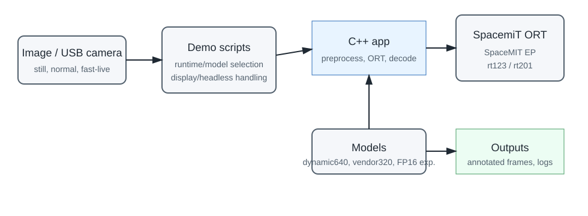
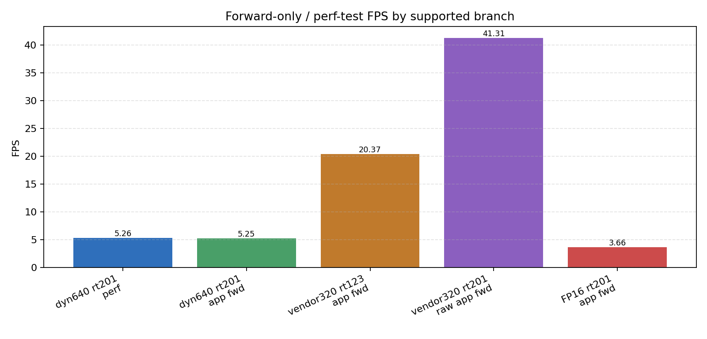
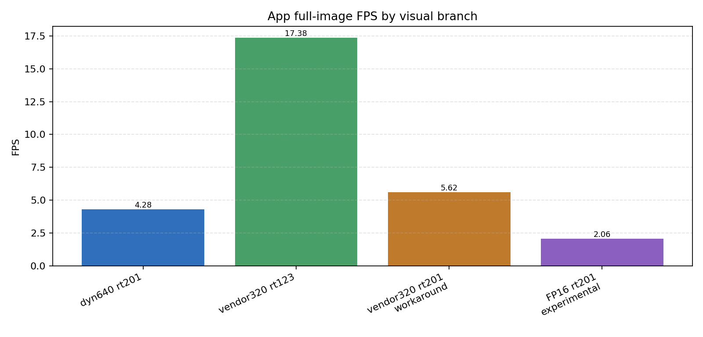
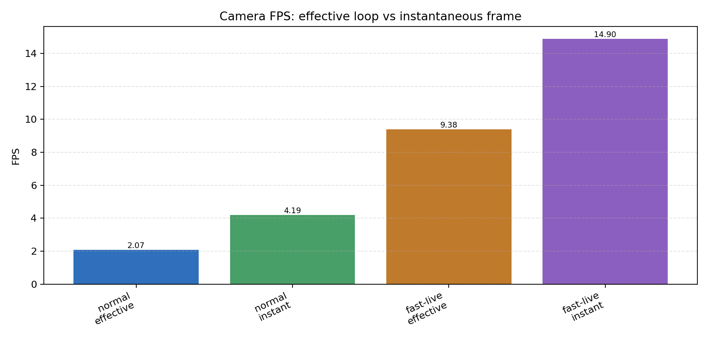
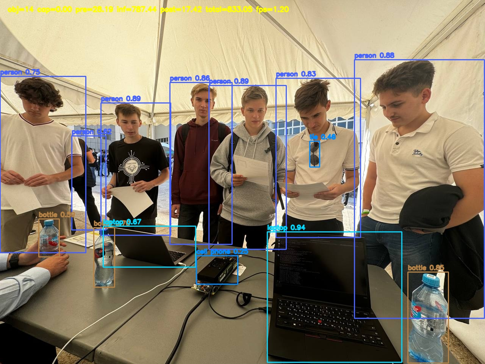
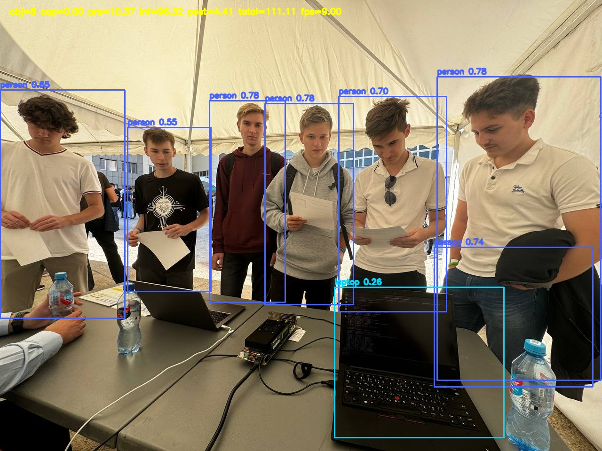
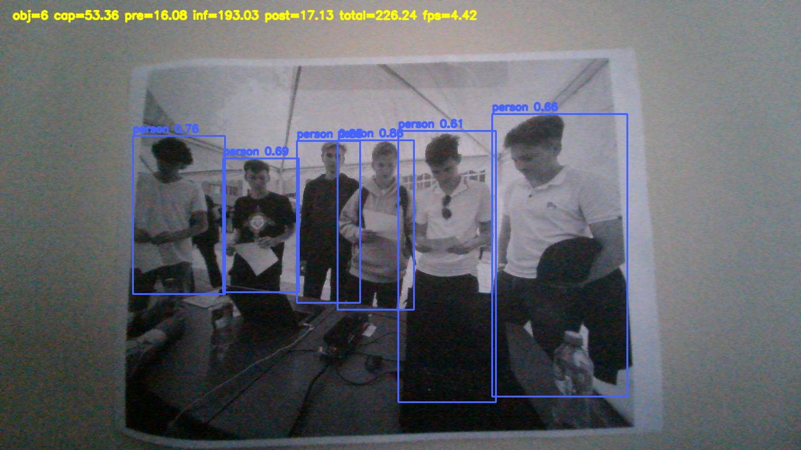
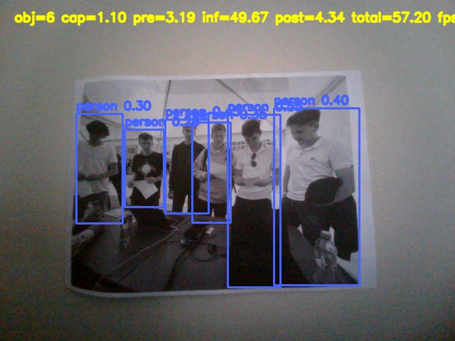

# Final Production Report: Banana YOLO11 SpacemiT Demo

Generated: 2026-07-01. Production tag `production-2026-07-02` remains unchanged and targets `9c0933be58ee122389d1a43f45f81e80655d6904`.

## Executive Summary

The Banana YOLO11 SpacemiT demo is production-handoff ready for Banana-Pi BPI-F3 / SpacemiT K1X under the frozen `production-2026-07-02` release reference. The accepted production source is `9c0933be58ee122389d1a43f45f81e80655d6904`. This report package is documentation-only and does not move the production tag or change runtime/model policy.

The release supports three operator-facing demo paths: primary image/normal-camera visual detection with generated dynamic640 INT8 on `rt201`, responsive fast-live camera detection with vendor320 INT8 on `rt123`, and trusted vendor320 visual checks on `rt123`. The raw vendor320 `rt201` path remains a low-latency benchmark branch only. FP16 and YOLO26 remain non-production.

Open P0: none. Open P1: none. Drive mirror verification is recorded as `verified-quick-by-operator`.

## Hardware and Software Environment

The target board is Banana-Pi BPI-F3 with SpacemiT K1X / X60. The canonical host/container workspace root is `/data`; the board target is `svt@banana`. The cross toolchain is `/data/SpacemiT/spacemit-toolchain-linux-glibc-x86_64-v1.1.2`, with base sysroot `${TOOLCHAIN_ROOT}/sysroot`, overlay sysroot `/data/sysroots/k1x-gtk3-overlay`, and ISA/ABI baseline `-march=rv64gcv_zvfh -mabi=lp64d`.

The release rules remain: source `/data/build_scripts/01-env.sh`, keep the base sysroot read-only, use overlay/staged dependencies for OpenCV and board libraries, and never copy a full board `/usr` into a sysroot.

## Production Scope and Runtime Policy

The frozen policy is:

| Branch | Runtime | Model/config | Production status |
| --- | --- | --- | --- |
| Primary image visual | `rt201` | generated dynamic640 INT8 | supported default |
| Normal camera | `rt201` | generated dynamic640 INT8 | supported default |
| Fast-live camera | `rt123` | vendor320 INT8, 320 letterbox | supported responsive branch |
| Vendor320 trusted visual | `rt123` | official vendor320 INT8 | supported visual branch |
| Vendor320 low-latency perf | raw `rt201` | official vendor320 INT8 | benchmark/perf only |
| Vendor320 rt201 visual workaround | `rt201` | official vendor320 INT8 + SHA256 guard | non-default workaround |
| FP16 | `rt201`/`rt202b1` | keep_io 640 | experimental only |
| Stable `rt202` | `rt202` | current paths | evaluated, not adopted |
| YOLO26n | n/a | n/a | P2 only, not production |

This policy is intentionally conservative. Stable `rt202` was staged and tested, but it aborts on the current production paths and is not adopted. YOLO26n is a P2 research candidate only.

## Application Architecture

The demo is a small C++/scripted deployment around ONNX Runtime with the SpaceMIT Execution Provider. Shell helpers select the runtime tag, model, camera/display/headless behavior, and benchmark mode. The C++ app performs preprocessing, ORT session execution, YOLO decode/postprocess, annotation, and output/log generation.



The production camera path favors stable `/dev/v4l/by-id` selection when available. Fast-live is a separate branch using a 320 letterbox model/runtime pair optimized for responsiveness.

## Model and Runtime Artifacts

Runtime provenance is pinned in `third_party_manifest/runtime.lock` and summarized in `release/RUNTIME_MANIFEST.md`:

| Tag | Bundle | Production role |
| --- | --- | --- |
| `rt123` | `spacemit-ort.riscv64.1.2.3` | vendor320 trusted visual and fast-live |
| `rt201` | `spacemit-ort.riscv64.2.0.1` | dynamic640 production and vendor320 perf |
| `rt202b1` | `spacemit-ort.riscv64.2.0.2+beta1` | FP16 640 experimental fallback |
| `rt202` | `spacemit-ort.riscv64.2.0.2` | staged regression evidence only; not adopted |

Model provenance is pinned or described in `third_party_manifest/models.lock`, `models/README.md`, and `release/MODEL_MANIFEST.md`:

| Artifact | Path | SHA256 | Role |
| --- | --- | --- | --- |
| Dynamic640 INT8 | `models/generated/xquant_640/yolov11n_640x640.dynamic_int8.onnx` | `d028fca47600213be18f876d23aef92ef39c3bb1b4bc6b76963e0be679f5467f` | primary visual and normal camera |
| Vendor320 INT8 | `models/vendor/yolo11/yolov11n_320x320.q.onnx` | `558011431ba1cd26269af3694abc2ee2fc2d467d7fe043e10df78ed7449d9edc` | trusted visual on `rt123`, perf on raw `rt201` |
| FP16 640 keep_io | `models/generated/fp16/yolov11n_640x640.fp16_iop32.onnx` | `4742625978c4b5cc25282bf02890837fcea7762d5536fe55e583311ce9b14593` | experimental on `rt201`/`rt202b1` |
| FP16 320 keep_io | `models/generated/fp16/yolov11n_320x320.fp16_iop32.onnx` | `3291474d7a8e40bc0fabf6feb054942675f562dab0c04666bddd47662eb27b69` | known fail / unsupported |

## Benchmark Methodology

The release does not collapse unlike measurements into one leaderboard. The metric taxonomy from `docs/FPS_SUMMARY.md` is reproduced below.

### Metric Taxonomy
Do not compare these metric classes as if they measured the same workload.

| Metric class | Meaning | Comparable with |
| --- | --- | --- |
| `perf_test forward` | Vendor `onnxruntime_perf_test` pure ORT inference ceiling. It excludes application preprocessing, postprocessing, rendering, and camera capture. | Other `perf_test forward` rows with the same benchmark settings. |
| `app forward-only` | Repo app forward benchmark using the app runtime/session path, but still excluding full image pre/post and camera capture. | Other app forward-only rows. |
| `app full image` | Single-image app pipeline: preprocess + inference + postprocess, plus normal app overhead for one still image. | Other app full image rows. |
| `camera effective` | Wall-clock live camera loop rate over N frames. It includes capture/decode, inference, display/headless loop, warmup effects, and any frame I/O. | Other camera effective rows with similar frame counts and display/headless conditions. |
| `camera instantaneous` | Per-frame instantaneous FPS from a reported frame total, usually after warmup. | Other camera instantaneous rows from similar frame positions/settings. |
| `visual sanity` | Semantic quality result, object count, or qualitative pass/fail. It is not a performance metric. | Other visual sanity rows only as correctness evidence. |
| `fail / rejected` | Runtime/model path is not usable or not adopted. Latency/FPS are `N/A` unless a failed feasibility smoke produced a timing before rejection. | Not used for production FPS comparisons. |

Fresh Day 1/Day 2 regression and Day 4 final acceptance evidence were used for the final table. Bounded Day 4 smoke numbers are treated as smoke evidence, not as a replacement for full regression tables.

## Performance Summary

Representative production and experimental rows are shown below. Full details are in the appendix and in `docs/FPS_SUMMARY.md` / `release/FPS_SUMMARY.md`.

| Metric class | Production path | Runtime/model | Mean latency ms | FPS | Interpretation | Source artifact |
| --- | --- | --- | ---: | ---: | --- | --- |
| `perf_test forward` | Primary dynamic640 | `rt201`, generated dynamic640 INT8 | 190.024 | 5.2623 | ORT inference ceiling only. | `docs/FPS_SUMMARY.md`, Day 2 `performance_regression_matrix.md` |
| `app forward-only` | Primary dynamic640 | `rt201`, generated dynamic640 INT8 | 190.567794 | 5.247476 | App session path without full image/camera overhead. | `docs/FPS_SUMMARY.md`, Day 2 `performance_regression_matrix.md` |
| `app full image` | Primary dynamic640 | `rt201`, generated dynamic640 INT8 | 233.480423 | 4.283014 | Still-image production visual path. | `docs/FPS_SUMMARY.md`, Day 2 `performance_regression_matrix.md` |
| `camera effective` | Normal camera | `rt201`, generated dynamic640 INT8 | N/A | 2.069 | Wall-clock live loop over Day 4 bounded smoke. | `docs/FPS_SUMMARY.md`, Day 4 final acceptance |
| `camera instantaneous` | Normal camera | `rt201`, generated dynamic640 INT8 | 238.716 | 4.189 | Per-frame timing, not loop FPS. | `docs/FPS_SUMMARY.md`, Day 4 `final_smoke_matrix.md` |
| `camera effective` | Fast-live camera | `rt123`, vendor320 INT8 | N/A | 9.382 | Responsive live branch over Day 4 bounded smoke. | `docs/FPS_SUMMARY.md`, Day 4 final acceptance |
| `camera instantaneous` | Fast-live camera | `rt123`, vendor320 INT8 | 67.121 | 14.898 | Per-frame timing for fast-live frame 20. | `docs/FPS_SUMMARY.md`, Day 4 `final_smoke_matrix.md` |
| `app full image` | Vendor320 trusted visual | `rt123`, vendor320 INT8 | 57.540777 | 17.378980 | Trusted 320 still-image visual branch. | `docs/FPS_SUMMARY.md`, Day 2 `performance_regression_matrix.md` |
| `app forward-only` | Vendor320 perf-only | raw `rt201`, vendor320 INT8 | 24.210065 | 41.305136 | Low-latency benchmark branch, not visual default. | `docs/FPS_SUMMARY.md`, Day 2 `performance_regression_matrix.md` |
| `app forward-only` | FP16 keep_io 640 experimental | `rt201`, FP16 keep_io 640 | 273.265611 | 3.659443 | Experimental only, not default. | `docs/FPS_SUMMARY.md`, Day 2 `performance_regression_matrix.md` |







## Visual / Correctness / Accuracy Evidence

The release contains visual/semantic sanity and output consistency evidence, not a full COCO mAP validation. No full COCO mAP claim is made.

Day 4 final acceptance passed image, normal camera, fast-live, headless, FP16 experimental smoke, loader proof, Doxygen, and hygiene checks. The primary still-image path detected 14 objects in the final Day 4 dynamic640 smoke; the vendor320 trusted visual path detected 8 objects in the final Day 4 smoke.

| Evidence | Asset | Source |
| --- | --- | --- |
| Primary dynamic640 still image | `release/assets/dynamic640_primary_day4.jpg` | Day 4 final acceptance output |
| Vendor320 trusted visual still image | `release/assets/vendor320_trusted_day4.jpg` | Day 4 final acceptance output |
| Normal camera still | `release/assets/camera_default_day4.jpg` | Day 4 final acceptance output |
| Fast-live camera still | `release/assets/camera_fast_day4.jpg` | Day 4 final acceptance output |
| Architecture diagram | `release/assets/architecture_diagram.svg` | generated from release docs |
| Runtime/model policy diagram | `release/assets/runtime_policy_diagram.svg` | generated from frozen policy |
| Forward FPS chart | `release/assets/chart_forward_fps.png` | generated from `docs/FPS_SUMMARY.md` / `release/FPS_SUMMARY.md` values |
| Full-image FPS chart | `release/assets/chart_full_image_fps.png` | generated from `docs/FPS_SUMMARY.md` / `release/FPS_SUMMARY.md` values |
| Camera FPS chart | `release/assets/chart_camera_fps.png` | generated from `docs/FPS_SUMMARY.md` / `release/FPS_SUMMARY.md` values |


Primary dynamic640 evidence:



Vendor320 trusted visual evidence:



## Camera Demo Behavior

The normal camera demo uses generated dynamic640 INT8 on `rt201`. Day 4 final acceptance passed fresh-clone and current-repo camera smoke. The bounded final smoke recorded stable by-id camera selection, MJPG capture, effective 2.069 FPS over 10 frames, and an instantaneous frame timing of 238.716 ms / 4.189 FPS.



Headless mode is explicitly supported through `HEADLESS_FLAG=1`; Day 4 headless smoke showed progress logs and no hang.

## Fast-live Mode

Fast-live is the responsiveness branch. It uses vendor320 INT8 on `rt123` with 320 letterbox. Day 4 final acceptance passed the fast-live smoke with effective 9.382 FPS over 20 frames and frame-20 instantaneous timing of 67.121 ms / 14.898 FPS.



## Loader / Deployment / Reproducibility Evidence

Day 4 fresh-clone proof passed `fetch_vendor_runtime`, `fetch_models`, cross-build, deploy, image demo, normal camera, fast-live, and headless smoke. Loader integrity passed for `app/bin/banana_yolo11_demo`, `bin/banana_yolo11_demo_rt201`, and `bin/banana_yolo11_demo_rt123`; production binaries resolved repo-local deployed runtime/OpenCV libraries and did not resolve system `/lib/libonnxruntime.so.1`.

The repo was published to GitHub and to the private GitLab mirror. The production tag `production-2026-07-02` is an annotated tag targeting `9c0933be58ee122389d1a43f45f81e80655d6904`. Host Drive verification was provided by the operator as `VERIFY=quick` with zero differences in the synchronized roots.

## Known Limitations

Known limitations are accepted and documented: stable `rt202` is staged but not adopted; FP16 remains experimental only; FP16 320 is unsupported; vendor320 raw `rt201` is perf-only; the vendor320 `rt201` visual workaround is SHA256-guarded and non-default; no full COCO mAP validation was performed; camera performance depends on camera mode, display/headless state, and live-loop conditions; latest-frame/drop-old-frames pipeline work is explicitly out of scope for this release.

## Rejected / Experimental Paths

Rejected or non-production paths remain: stable `rt202` dynamic640/FP16/vendor320 aborts; YOLO26n float and dynamic INT8 were rejected for production due semantic failure and are P2 only; true FP16 I/O models are dtype evidence but not a supported board chain; FP16 keep_io 640 on `rt201`/`rt202b1` is usable but experimental; official public 640 INT8 artifact search and camera pipeline R&D remain P2.

## Reproduction Commands

```bash
source /data/build_scripts/01-env.sh
./scripts/fetch_vendor_runtime.sh
./scripts/fetch_models.sh
./scripts/build_cross.sh
./scripts/deploy_to_banana.sh
./scripts/run_image_demo.sh
./scripts/run_camera_demo.sh
./scripts/run_camera_demo_fast.sh
HEADLESS_FLAG=1 ./scripts/run_camera_demo.sh
./scripts/bench_forward_only.sh
./scripts/bench_full_demo.sh
```

Selected explicit branches:

```bash
BANANA_DEMO_RUNTIME_TAG=rt123 ./scripts/run_image_demo.sh models/vendor/yolo11/yolov11n_320x320.q.onnx 320 0.25
BANANA_DEMO_RUNTIME_TAG=rt201 ./scripts/bench_forward_only.sh models/vendor/yolo11/yolov11n_320x320.q.onnx 320
FP16_RUNTIME_TAGS=rt201,rt202b1 FP16_MODEL_VARIANT=keep_io ./scripts/bench_fp16_matrix.sh
```

## Release References

| Reference | Value |
| --- | --- |
| GitHub | `git@github.com:RISCY-SVT/banana-yolo11-spacemit-demo.git` |
| GitLab | `git@gitlab.itglobal.com:riscy/sw/banana-yolo11-spacemit-demo.git` |
| Production source commit | `9c0933be58ee122389d1a43f45f81e80655d6904` |
| Production tag | `production-2026-07-02` pointing to `9c0933be58ee122389d1a43f45f81e80655d6904` |
| Drive mirror status | `verified-quick-by-operator` from operator VERIFY=quick evidence |
| Day 4 acceptance logs | `/data/ncnn-logs/ort-logs/2026-06-28_19-47-11/` |
| FPS summary logs | `/data/ncnn-logs/ort-logs/2026-06-28_21-15-03/` |
| Tag handoff logs | `/data/ncnn-logs/ort-logs/2026-06-29_13-34-54/` |
| GitLab publish logs | `/data/ncnn-logs/ort-logs/2026-06-29_14-22-45/` |

## Appendix: Full FPS Table

The following table is copied from the authoritative `docs/FPS_SUMMARY.md`, which includes evidence source per row.

### Consolidated Matrix

| Category | Variant | Runtime | Model/config | Mode / metric class | Resolution | Mean latency ms | FPS | Object count / visual status | Production status | Caveats | Evidence source |
| --- | --- | --- | --- | --- | --- | ---: | ---: | --- | --- | --- | --- |
| Supported production | Primary visual forward ceiling | `rt201` | generated dynamic640 INT8 | `perf_test forward` | 640x640 | 190.024 | 5.2623 | visual status from full/image rows: reasonable | primary production visual branch | Pure ORT ceiling only; no app pre/post. | Day 2 `performance_regression_matrix.md` |
| Supported production | Primary visual app forward | `rt201` | generated dynamic640 INT8 | `app forward-only` | 640x640 | 190.567794 | 5.247476 | reasonable in image regression | primary production visual branch | Forward-only, not full image/camera. | Day 2 `performance_regression_matrix.md` |
| Supported production | Primary visual full image | `rt201` | generated dynamic640 INT8 | `app full image` | 640x640 | 233.480423 | 4.283014 | 14 objects, reasonable | primary production visual branch | Use for still-image app pipeline; Day 4 final smoke also passed at 854.707 ms one-shot acceptance run. | Day 2 `performance_regression_matrix.md`; Day 4 `final_smoke_matrix.md` |
| Supported production | Normal camera effective | `rt201` | generated dynamic640 INT8 | `camera effective` | model 640x640; camera 1280x720 MJPG | N/A | 2.069 | pass; stable by-id camera | primary normal camera | Day 4 bounded final smoke over 10 frames; includes warmup/live loop overhead. | Day 4 `PRODUCTION_FINAL_ACCEPTANCE_REPORT.md` |
| Supported production | Normal camera instantaneous | `rt201` | generated dynamic640 INT8 | `camera instantaneous` | model 640x640; camera 1280x720 MJPG | 238.716 | 4.189 | pass at frame 10 | primary normal camera | Single frame timing from Day 4 camera smoke, not wall-clock loop FPS. | Day 4 `final_smoke_matrix.md` |
| Supported production | Fast-live camera effective | `rt123` | vendor320 INT8 letterbox | `camera effective` | model 320x320; camera 640x480 | N/A | 9.382 | pass; stable by-id camera | fast-live production branch | Day 4 bounded final smoke over 20 frames; includes warmup/live loop overhead. | Day 4 `PRODUCTION_FINAL_ACCEPTANCE_REPORT.md` |
| Supported production | Fast-live camera instantaneous | `rt123` | vendor320 INT8 letterbox | `camera instantaneous` | model 320x320; camera 640x480 | 67.121 | 14.898 | pass at frame 20 | fast-live production branch | Single frame timing; best responsiveness path, not highest-detail visual path. | Day 4 `final_smoke_matrix.md` |
| Supported production | Vendor320 trusted visual perf_test | `rt123` | official vendor320 INT8 | `perf_test forward` | 320x320 | 48.3266 | 20.6767 | visual branch reasonable | trusted vendor320 visual | Pure ORT ceiling only. | Day 2 `performance_regression_matrix.md` |
| Supported production | Vendor320 trusted visual app forward | `rt123` | official vendor320 INT8 | `app forward-only` | 320x320 | 49.095494 | 20.368468 | visual branch reasonable | trusted vendor320 visual | Forward-only. | Day 2 `performance_regression_matrix.md` |
| Supported production | Vendor320 trusted visual full image | `rt123` | official vendor320 INT8 | `app full image` | 320x320 | 57.540777 | 17.378980 | 8 objects, reasonable | trusted vendor320 visual | Full image benchmark; Day 4 final smoke also passed with 8 objects. | Day 2 `performance_regression_matrix.md`; Day 4 `final_smoke_matrix.md` |
| Supported production | Vendor320 low-latency perf perf_test | `rt201` | official vendor320 INT8 raw | `perf_test forward` | 320x320 | 24.4143 | 40.9483 | perf only | low-latency benchmark branch | Raw rt201 path is not a production visual default. | Day 2 `performance_regression_matrix.md` |
| Supported production | Vendor320 low-latency perf app forward | `rt201` | official vendor320 INT8 raw | `app forward-only` | 320x320 | 24.210065 | 41.305136 | perf only | low-latency benchmark branch | Raw rt201 path is benchmark/perf only; visual semantics are not trusted without workaround. | Day 2 `performance_regression_matrix.md` |
| Supported non-default | Vendor320 rt201 visual workaround | `rt201` | official vendor320 INT8 + SHA256-guarded EP workaround | `app full image` | 320x320 | 178.049 | 5.616 | 9 objects, reasonable | non-default available workaround | Much slower than trusted rt123 benchmark path; only enabled deliberately/guarded. | Day 2 `image_regression_matrix.md` |
| Experimental FP16 | FP16 keep_io 640 perf_test | `rt201` | `yolov11n_640x640.fp16_iop32.onnx` | `perf_test forward` | 640x640 | 270.867 | 3.69176 | experimental pass | experimental usable | Not production default; FP32 I/O with internal FP16 weights. | Day 2 `performance_regression_matrix.md` |
| Experimental FP16 | FP16 keep_io 640 app forward | `rt201` | `yolov11n_640x640.fp16_iop32.onnx` | `app forward-only` | 640x640 | 273.265611 | 3.659443 | experimental pass | experimental usable | Not production default. | Day 2 `performance_regression_matrix.md` |
| Experimental FP16 | FP16 keep_io 640 full image | `rt201` | `yolov11n_640x640.fp16_iop32.onnx` | `app full image` | 640x640 | 485.721 | 2.059 | 13 objects, reasonable | experimental usable | Canonical-photo visual sanity only; not production path. | Day 2 `image_regression_matrix.md` |
| Experimental FP16 | FP16 keep_io 640 perf_test | `rt202b1` | `yolov11n_640x640.fp16_iop32.onnx` | `perf_test forward` | 640x640 | 293.060863 | 3.41212 | experimental pass | experimental usable fallback | Stable rt202 does not replace rt202b1. | Day 2 `performance_regression_matrix.md` |
| Experimental FP16 | FP16 keep_io 640 app forward | `rt202b1` | `yolov11n_640x640.fp16_iop32.onnx` | `app forward-only` | 640x640 | 294.988206 | 3.389966 | experimental pass | experimental usable fallback | Not production default. | Day 2 `performance_regression_matrix.md` |
| Experimental FP16 | FP16 keep_io 640 full image | `rt202b1` | `yolov11n_640x640.fp16_iop32.onnx` | `app full image` | 640x640 | 503.659 | 1.985 | 13 objects, reasonable | experimental usable fallback | Canonical-photo visual sanity only; not production path. | Day 2 `image_regression_matrix.md` |
| Experimental FP16 | FP16 keep_io 320 | `rt201` / `rt202b1` | `yolov11n_320x320.fp16_iop32.onnx` | `fail / rejected` | 320x320 | N/A | N/A | expected fail | unsupported | EP reshape/compile failure; documented unsupported. | `docs/RESULTS.md` FP16 matrix |
| Experimental FP16 | True FP16 I/O models | `rt123` / `rt201` / `rt202b1` | `yolov11n_320x320.fp16.onnx`; `yolov11n_640x640.fp16.onnx` | `fail / rejected` | 320x320 and 640x640 | N/A | N/A | dtype-correct but not runnable | unsupported board path | Retained as dtype evidence, not usable board runtime chain. | `docs/RESULTS.md` FP16 model provenance |
| Rejected / P2 | Stable rt202 dynamic640 candidate | `rt202` | generated dynamic640 INT8 | `fail / rejected` | 640x640 | N/A | N/A | abort | rejected; not adopted | Aborts even after clean board reboot; does not replace rt201. | Day 2 `stable_rt202_decision.md` |
| Rejected / P2 | Stable rt202 FP16 640 candidate | `rt202` | FP16 keep_io 640 | `fail / rejected` | 640x640 | N/A | N/A | abort | rejected; not adopted | Aborts; does not replace rt202b1. | Day 2 `stable_rt202_decision.md` |
| Rejected / P2 | Stable rt202 vendor320 candidate | `rt202` | official vendor320 INT8 | `fail / rejected` | 320x320 | N/A | N/A | abort | rejected; not adopted | No stable rt202 vendor320 fix. | Day 2 `stable_rt202_decision.md` |
| Rejected / P2 | YOLO26n float 640 | `rt201` | YOLO26n float ONNX | `app full image feasibility` | 640x640 | 600.287 | 1.666 | giant false refrigerator box | P2 only; rejected for production | Timing exists only from failed feasibility smoke; semantic failure blocks adoption. | Day 1 `yolo26n_feasibility.md` / `docs/RESULTS.md` |
| Rejected / P2 | YOLO26n dynamic INT8 640 | `rt201` | YOLO26n dynamic INT8 ONNX | `app full image feasibility` | 640x640 | 1147.946 | 0.871 | giant false refrigerator box | P2 only; rejected for production | Slower than current dynamic640 and semantically bad. | Day 1 `yolo26n_feasibility.md` / `docs/RESULTS.md` |
| Rejected / P2 | rt202b1 production replacement | `rt202b1` | 2.0.2+beta1 runtime line | `visual sanity` | various | N/A | N/A | not adopted as production runtime | P2/historical-experimental | Still kept for FP16 keep_io 640 experimental because stable rt202 failed replacement. | Day 2 `stable_rt202_decision.md` |
| Rejected / P2 | Official public 640 INT8 artifact | N/A | official vendor YOLO11n 640 INT8 | `fail / rejected` | 640x640 | N/A | N/A | not found | P2 search only | No pinned official public artifact found; production uses generated dynamic640 INT8. | `docs/RESULTS.md` quantization notes |
| Rejected / P2 | Latest-frame/drop-old-frames pipeline | N/A | camera architecture R&D | `fail / rejected` | camera | N/A | N/A | not implemented | P2 R&D | Out of scope for 2026-07-02 production handoff. | `release/KNOWN_LIMITATIONS.md` |

### Reading Notes

- The fastest number in the table is the raw vendor320 `rt201` forward path, but
  that branch is performance-only and not a production visual default.
- The primary production visual branch remains generated dynamic640 INT8 on
  `rt201` because it gives the accepted production visual behavior.
- The responsive live branch is `run_camera_demo_fast.sh`, using vendor320 on
  `rt123`. It is a separate product branch, not a replacement for the
  highest-detail dynamic640 branch.
- Stable `rt202` and YOLO26n are explicitly rejected for production in this
  scope. They remain P2 follow-up items only.

## Appendix: Artifact Index

| Evidence | Asset | Source |
| --- | --- | --- |
| Primary dynamic640 still image | `release/assets/dynamic640_primary_day4.jpg` | Day 4 final acceptance output |
| Vendor320 trusted visual still image | `release/assets/vendor320_trusted_day4.jpg` | Day 4 final acceptance output |
| Normal camera still | `release/assets/camera_default_day4.jpg` | Day 4 final acceptance output |
| Fast-live camera still | `release/assets/camera_fast_day4.jpg` | Day 4 final acceptance output |
| Architecture diagram | `release/assets/architecture_diagram.svg` | generated from release docs |
| Runtime/model policy diagram | `release/assets/runtime_policy_diagram.svg` | generated from frozen policy |
| Forward FPS chart | `release/assets/chart_forward_fps.png` | generated from `docs/FPS_SUMMARY.md` / `release/FPS_SUMMARY.md` values |
| Full-image FPS chart | `release/assets/chart_full_image_fps.png` | generated from `docs/FPS_SUMMARY.md` / `release/FPS_SUMMARY.md` values |
| Camera FPS chart | `release/assets/chart_camera_fps.png` | generated from `docs/FPS_SUMMARY.md` / `release/FPS_SUMMARY.md` values |

Additional release files: `release/PRODUCTION_READINESS_REPORT.md`, `release/PRODUCTION_CHECKLIST.md`, `release/DEMO_COMMANDS.md`, `release/RUNTIME_MANIFEST.md`, `release/MODEL_MANIFEST.md`, `release/BUILD_MANIFEST.md`, `release/KNOWN_LIMITATIONS.md`, `release/HANDOFF_NOTES.md`, and `release/FPS_SUMMARY.md`.
